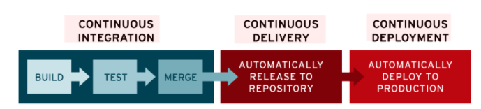
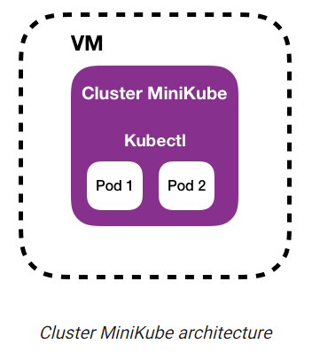
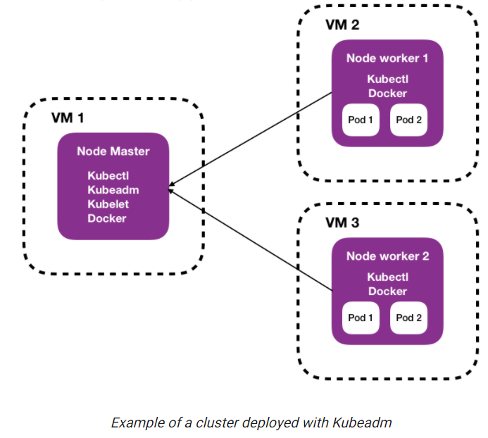
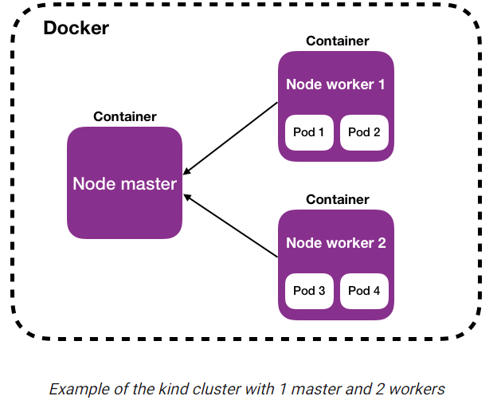
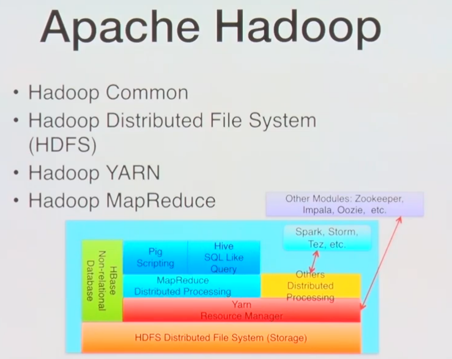
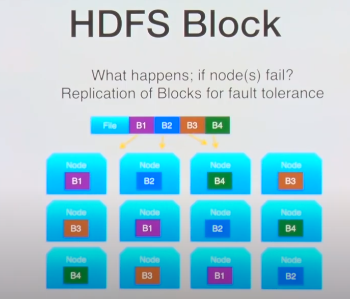
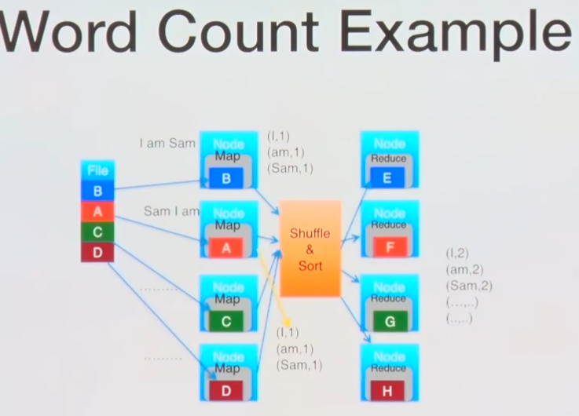

# 기초지식

## ETC
### Servlet이란

https://stackoverflow.com/questions/7213541/what-is-java-servlet
https://mangkyu.tistory.com/14

A servlet is simply a class which responds to a particular type of network request - most commonly an HTTP request. Basically servlets are usually used to implement web applications - but there are also various frameworks which operate on top of servlets (e.g. Struts) to give a higher-level abstraction than the "here's an HTTP request, write to this HTTP response" level which servlets provide.

Servlets run in a servlet container which handles the networking side (e.g. parsing an HTTP request, connection handling etc). One of the best-known open source servlet containers is Tomcat.

서블릿은 특정한 타입의 네트워크 요청(주로 HTTP 요청)에 응답하기 위한 클래스.  
혹은 클라이언트의 요청을 처리하고, 그 결과를 반환하는 Servlet 클래스의 구현 규칙을 지킨 자바 웹 프로그래밍 기술

### 서블릿 동작 방식

https://www.geeksforgeeks.org/introduction-java-servlets/

1. 클라이언트가 웹서버에 요청을 송신
2. 웹서버가 요청을 수신
3. 웹서버는 대응하는 서블릿에 요청을 전달
4. 서블릿이 요청을 처리하고 응답(response) 생성
5. 웹서버에게 응답을 전달
6. 웹서버가 클라이언트에게 응답을 돌려주고 클라이언트의 브라우저가 이를 화면에 보여줌.

### 서블릿 생명주기 [todo]

1-1. 처음 로드된다면 init() -> 각종 세팅 적용(e.g. 인코딩방식)
1-2. 로드된적이 있다면 꺼내기
2-1. service() 수행 -> doGet() or doPost()
3-1. 톰캣이 내려갈때 destroy()

### 서블릿 구조

Servlet Interface -> GenericServlet Class -> HttpServlet Class -> CustomServlet Class

## Java

### ArrayList  
기본 capacity는 10  
데이터 조회시 index 체크하고, 해당하는 배열의 값 return  
데이터 추가시 현재 capacity를 확인하고, 꽉 찼으면 grow  
데이터 삭제시 index 를 체크하고, array를 copy.  

### LinkedList
양방향 list  
데이터 조회시 index 체크하고, 앞/뒤에서 가까운 쪽으로 순회하면서 equals  
데이터 추가시 linkLast를 호출  
데이터 삭제시 조회를 수행해서 Node를 꺼내고, unlink  

# Working

## Devops

### CI/CD
https://www.redhat.com/ko/topics/devops/what-is-ci-cd
https://junghyeonsu.tistory.com/65 (+k8s)
https://medium.com/finda-tech/finda-msa%EB%A5%BC-%EC%9C%84%ED%95%9C-kubernetes-%EC%84%B8%ED%8C%85%EA%B3%BC-ci-cd-pipeline-%EA%B5%AC%EC%84%B1-%EA%B7%B8%EB%A6%AC%EA%B3%A0-monitoring-%EC%8B%9C%EC%8A%A4%ED%85%9C-%EA%B5%AC%EC%B6%95-2-ef29380ec474(+ k8s)

CI : Continuous Integration(지속적 통합), 개발자를 위한 것 = 자동화된 빌드 및 테스트가 수행된 후, 코드 변경사항을 중앙 레포지토리에 정기적으로 병합하는 데브옵스 소프트웨어 개발방식. 여러명의 개발자가 동시에 애플리케이션 개발과 관련된 코드작업을 할 경우, 서로 충돌할 수 있는 문제를 해결할 수 있다.  
대개 Jenkins를 이용(or Gitlab CI)

CD : Continuous Delivery(지속적 제공) 혹은 Continuous Deployment(지속적 배포) : 최소한의 노력으로 새로운 코드를 배포하는 것을 목표로함. 개발자의 변경 사항을 레포지토리에서 고객이 사용 가능한 프로덕션 환경까지 자동으로 release하는 것을 의미. (=> 애플리케이션 제공 속도를 저해하는 수동 프로세스로 인한 운영팀의 프로세스 과부하 문제를 해결.  
대개 ArgoCD를 이용(in K8s)

### Helm
package manaer for kubernetes. 쿠버네티스의 패키지 매니저.  
쿠버네티스에서 패키징, 구성 및 설정, 배포에 관련된 작업들을 보다 수월하게 할 수 있도록 도와줌.

Chart 라는 개념을 사용하는데, "사전에 구성된 쿠버네티스 manifest들"을 의미.

### ArgoCD

k8s를 위한 GitOps 지속적 전달 툴.(선언적)  
* 동작 방식 :   
1. ArgoCD가 쿠버네티스 운영을 관리하는 manifest 파일들이 있는 원격 레포지토리를 조회.
2. 원격 레포에 있는 manifest와 실제 k8s의 manifest를 비교(diff) 하여, 달라진 부분을 확인하고, 이를 반영(sync)

* argoCD는 쿠버네티스 클러스터 내에 있어야한다. 쿠버네티스에 배포되어 있는 yaml 파일의 내용을 알고 있어야 하기 때문.

### tibero
> 온라인 매뉴얼 : https://technet.tmaxsoft.com/upload/download/online/tibero/pver-20150504-000001/index.html

> tibero studio = GUI 툴 (MySQL의 workbench 같은것)

### minikube, kubeadm, kind, k3s 무슨 차이일까 ?
https://www.padok.fr/en/blog/minikube-kubeadm-kind-k3s

#### minikube

로컬에서 간단하게 실행할 수 있는(연습용) 쿠버네티스. 설치하기 쉽지만, 다른 node를 추가할 수 없다. (VM 내에서 실행)

#### kubeadm

쿠버네티스 매운맛. 마스터노드와 워커노드를 분리할 수 있지만, 구동하는 노드의 성능이 좋아야 한다.   

#### kind

minikube 처럼 로컬에서 쿠버네티스 클러스터를 배포할 수 있는 툴. 다만 minikube와 달리 docker 내에서 구동된다.  

#### k3s
k8s 에서 8을 3으로 줄임 -> lightweight를 의미  
작은 서버나 IoT와 같은 곳에서 사용될 수 있다.  
(모놀리틱 커널과 마이크로커널 같은 느낌)
모든 애드온이 삭제되고, 딱 필요한 최소한만 들어있음.
노드 성능이 제한될 경우 kubeadm의 좋은 대체가 될 수 있다.

# Data-engineering

## apache spark

### Apache Hadoop

  
Hadoop은 클러스터 혹은 환경으로 봄.

HDFS : Master-slave Design을 가짐. Hardware Failure 에 대처하기 위해 카피본을 저장함. "큰 파일"을 잘 저장함. 작은 파일을 많이 저장하는데에는 좋지 않음.  

Master node : metadata(name, location, directory)를 저장함. 장애시 모든 metadata가 날아가기 때문에 고가용성이 필요. heartbeat를 날림 (node가 살아있는지 확인)

Slave node : 실제 data를 block 단위로 저장함.

#### HDFS
파일 하나를 4개로 나눠서, 12개의 노드에 나누어서 and 복사해서 저장함(특정 노드가 문제가 될 경우를 대비)

HDFS는 block단위로 나뉜다. 기본 사이즈는 64MB (128MB도 가능) & 블럭을 복제해서 저장.

#### MapReduce
하둡 에코시스템의 기본적인 프로그래밍 패러다임.  
기존에는 여러 대의 컴퓨터(노드)를 다루는것이 쉽지 않았음.(=결국 병렬처리이기때문) (e.g. 멀티스레딩, 동기화문제 -> lock, semaphore ...) + 기존 file system은 hardware failure에 not fault tolerant  
-> Hadoop은 이러한 문제를 고려할 필요가 없음. 그냥 요청하면 됨.

shuffling -> 데이터를 섞는 것(*왜 섞지*)  
shuffle & sort -> accumulation

### apache spark
목적 : 기존 Hadoop의 

Yarn : 리소스 매니저

# Errors

## 1. tibero - tbboot

시도 : tbboot 명령어 사용 (in cmd) (database 실행)
에러 : Tibero_tibero is stopped and disabled. Please confirm the service state or event logs (Application / System)
해결방안 1. tbdown clean 
해결방안 2(*). 관리자 권한으로 cmd 실행

## AWS EC2 SSH 접속

시도 : ssh -i key.pem [주소]
에러 : Permission denied (publickey)
해결방안 (*) : 주소 앞에 계정 이름을 안붙였음. ubuntu@[주소] 여야함.