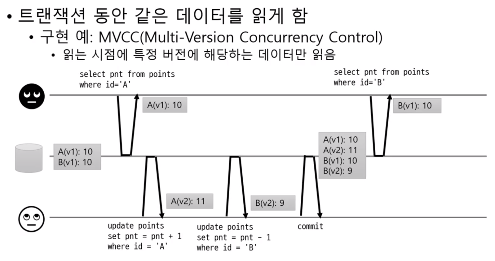
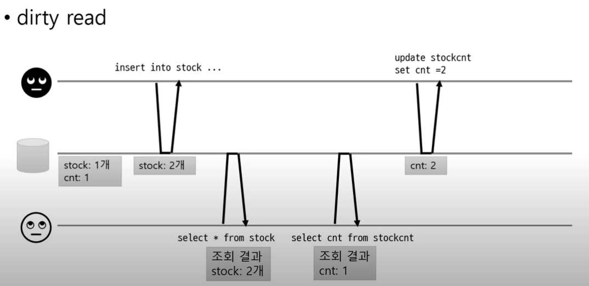

# 기초지식
## Database

### Transaction
개념 : 여러 읽기와 쓰기를 논리적으로 하나로 묶음
트랜잭션 시작 - 여러 쿼리 실행 - 커밋(반영O) 또는 롤백(반영X)

#### why transaction ?
쿼리를 실행하다가 문제가 발생하면, 어플리케이션이 데이터의 일관성을 보장해야함.

#### transaction의 범위
**커넥션기준**으로 진행됨.

커넥션 A를 연결(also start tx)하고, 그 와중에서 커넥션B를 연결(also start tx)했는데, 커넥션 B에서 문제가 발생하면 커넥션 A에서도 롤백을 해야함. (반대로도 동작해야 함. 커넥션 A가 끝나기 직전에 문제가 생기면? 커밋했던 커넥션B도 롤백해야 함)

==> 말인 즉슨, 여러 메소드를 호출할 때, 하나의 트랜잭션으로 묶고 싶다면, 커넥션을 하나만 사용해야 한다.

#### transaction 전파

@Transactional 로 묶어놓으면, 그 내부 메소드 호출중에 문제가 생겨도 괜찮다 : 즉, 커넥션 객체를 전달하지 않아도 한 트랜잭션으로 묶어서 실행해줌

#### 트랜잭션 & 외부 연동
외부 연동이 섞여 있으면, 롤백 처리에 주의해야한다.

e.g. api를 호출하고, 다른 작업을 하다가 실패해서 rollback 해야한다면? api를 호출했다는 점은 롤백처리가 안된다.

e.g.2. api 호출 자체는 성공했는데, receive 하지 못했다면? 비슷하게 문제가 됨.

#### global transaction
두 개 이상의 자원을 한 트랜잭션으로 묶어서 처리할 수 있음
(e.g. database 두개를 연동한다던지..)

* 조건 : 각 자원이 2PC(two-phase commit)을 지원해야 함
* 단점 : 성능이 떨어짐. 마이크로서비스에선 아키텍쳐 상 사용하기가 어려움 --> 거의 사용하지 않는다.
* **따라서** 다중 자원에 대한 데이터 처리가 필요하면, 이벤트나 비동기 메시징같은 다른 수단 고려

#### 동시성 문제
같은 자원에 동시에 여러 명이 접근하면? 즉, Race Condition 이 생기면?  
-> Transaction 격리 : 다른 트랜잭션으로 인해 내 트랜잭션이 영향을 받지 않도록 하는것

가장 간단한 방법 : 무조건 순서대로만 실행하게 하는 것. But 성능 저하

다른 방법 = **트랜잭션 격리 레벨**  
https://chrisjune-13837.medium.com/db-transaction-isolation-level-f21b6d1e64eb 
밑으로 갈수록 고립 정도가 높아짐.
1. Read Uncommitted (잘 안쓰임. 격리가 안되는 수준)
2. Read Commited : 커밋된 데이터만 읽기.   
즉, 커밋된 값과 트랜잭션이 진행중인 값을 따로 보관. OR 커밋된 데이터만 덮어쓰기. 즉, 행 단위로 잠금해서, 선점한 트랜잭션의 작업이 끝나기전까지 내 트랜잭션은 대기.
3. Repeatable Read  
(? Read Committed랑 같은거 아닌가) : 특정 버전에 해당하는 데이터만 읽는다

4. Serializable  
인덱스 기반 or 조건 기반 잠금.  


**DB의 격리 레벨 동작 방식을 알아야 한다.** e.g. oracle = read committed, mysql = repeatable read

**발생할 수 있는 문제들 ?**
1. 커밋되지 않은 데이터 읽기(dirty read)  
List가 있다고 했을 때, add(Object) 라고 해보자. 그러면 1. 실제 데이터를 추가하기 2. size++; 두 과정을 거쳐야 하는데, 1번 이후에 get()과 size()를 수행한다면? get은 동작하겠지만 size랑은 맞지 않음.  

2. 커밋되지 않은 데이터 덮어쓰기(dirty write)  
'갑'이 row1과 row2의 owner칼럼을 A, A로 바꾸려고 하고, '을'이 row1과 row2의 owner칼럼을 B,B 로 바꾸려고 함. 근데 '갑'이 row1만 바꾼 상태에서 '을'의 작업이 두개가 수행되고, 그 다음 '갑' 의 row2 작업이 수행되면, A/A 혹은 B/B가 아닌 B/A 가 되버림.  
  
> (1-2) 는 Read Commited를 통해 해결 가능  
3. 읽는 동안 데이터 변경 1(read skew)  

두개 A, B에서, 10을 조회하는 와중에 A가 11, B가 9가 되면, B를 조회할때 9가 되버림(10이 아니고)  
> Repeatable Read로 해결 가능
4. 변경 유실(Lost Update)  
Read Committed나 Repeatable Read를 활용하더라도 문제 발생

> 원자적 연산 사용 / 명시적인 잠금 / CAS(Compare and set) 을 사용해서 해결할 수 있음.  
> 원자적(atomic) 연산 : DB가 지원하는 원자젹 연산 : 동시 수정 요청에 대해 DB가 순차 처리. e.g. update article set readcnt = readcnt + 1 where id = 1  
> 명시적 잠금 : 조회할 때, 수정할 행을 미리 잠금. 잠겨 있는 동안에는 select조차 불가능하게 막음. e.g. **select** * from table where id = 1 **for update**     
> CAS : 수정할때, 값이 같은지 비교해서, 같은 경우에만 수정  


5. 읽는 동안 데이터 변경 2  
두 데이터가 서로 다른 녀석을 사용하는데 문제가 됨. 왜? 당직자는 (duty=true인 사람) 최소 1명 이상 있어야 하기 때문에.  
  
> Serializable로 해결
#### ACID

* Atomicity : 원자성 : all or nothing. 
* Consistency : 일관성 : 미리 정의된 규칙에서만 수정이 가능하다.(e.g. 숫자 칼럼에 문자열 저장 X) 이를 위반하면 트랜잭션이 종료됨.
* Isolation : 고립성 : 두 개의 트랜잭션이 작업할 때 서로의 작업에 끼어들 수 없도록 하는 것. (성능 이슈로 인해 유연하게 제약)
* Durability : 지속성 : 성공적으로 수행된 트랜잭션은 영원히 반영되어야 한다(전형적으로 모든 트랜잭션은 로그로 남는다. 즉, 로그에 모든 것이 저장된 후에만 commit으로 간주한다.)


## Web

### 동기 비동기 $$$$$$$$$$$
https://musma.github.io/2019/04/17/blocking-and-synchronous.html

### Authorization, Authentication

* Authentication(인증) : 자신이 누구라고 주장하는 사람을 확인하는 절차
* Authorization(인가, 권한부여) : 가고싶은 곳으로 가도록, 혹은 원하는 정보를 얻도록 허용하는 과정

### OAuth

#### Terminology  
1. Client : Resource Server를 사용하는 주체. 내가 만드는 Application  
2. Resource Owner : Resource server에 인증되어 있는 사용자.  내가 만든 Application을 사용하는 사용자  
3. Resource Server : 데이터를 가진 서버. 내가 만든 Application이 요청할 서버  

#### OAuth를 쓰는 이유
1. 사용자가 A 어플리케이션을 사용하는데, A 어플리케이션에서 B(e.g. 구글)의 정보(혹은 기능)가 필요한 상황을 가정해보자.
2. 단순하게 생각하면, A 어플리케이션에 B의 ID/PW를 제공해서 정보를 제공할 수 있음
3. But, 만약 A 어플리케이션의 악의를 가지고 다른 서비스도 이용해버린다면? 개인정보를 탈취한다던지...
4. 이러한 상황을 방지하기 위해, "필요한 정보"만 제공할 수 있도록 하는 것 = OAuth

#### OAuth 1.0과 2.0의 차이
https://stackoverflow.com/questions/4113934/how-is-oauth-2-different-from-oauth-1

1. 웹브라우저 기반이 아닌 앱에서도 사용가능해졌다. (기존에는 데스크탑 앱이나 모바일 앱은 브라우저로 redirect 해서, 서비스에 인증하고, 서비스로부터 토큰을 복사해와야 했음)
2. 클라이언트 애플리케이션에 암호화가 필요하지 않다.
3. 서명이 덜 복잡하다. 특별한 파싱, 정렬, 인코딩이 필요 없다.
4. 액세스 토큰 수명이 짧다. 1.0은 1년 이상 저장할 수 있다. 2.0에는 refresh token이라는 개념이 있다. (밑에서 다시)

#### access token, refresh token
https://tansfil.tistory.com/59
> OAuth에만 한정된 개념이 아님. token 기반 인증 개념

* access token : 아주 짧은 기간을 가진, 인증 token
* refresh token : 상대적으로 긴 기간을 가진 token, access token을 재발행하는데 사용.


1\. 사용자가 ID , PW를 통해 로그인합니다.  
2\. 서버에서는 회원 DB에서 값을 비교합니다(보통 PW는 일반적으로 암호화해서 들어갑니다)  
3~4\. 로그인이 완료되면 Access Token, Refresh Token을 발급합니다. 이때 일반적으로 회원DB에 Refresh Token을 저장해둡니다.  
5\. 사용자는 Refresh Token은 안전한 저장소에 저장 후, Access Token을 헤더에 실어 요청을 보냅니다.    
6~7\. Access Token을 검증하여 이에 맞는 데이터를 보냅니다.  
8\. 시간이 지나 Access Token이 만료됐다고 보겠습니다.  
9\. 사용자는 이전과 동일하게  Access Token을 헤더에 실어 요청을 보냅니다.   
10~11\. 서버는 Access Token이 만료됨을 확인하고 권한없음을 신호로 보냅니다.  

** Access Token 만료가 될 때마다 계속 과정 9~11을 거칠 필요는 없습니다.

 사용자(프론트엔드)에서 Access Token의 Payload를 통해 유효기간을 알 수 있습니다. 따라서 프론트엔드 단에서 API 요청 전에 토큰이 만료됐다면 바로 재발급 요청을 할 수도 있습니다.

12\. 사용자는 Refresh Token과 Access Token을 함께 서버로 보냅니다.  
13\. 서버는 받은 Access Token이 조작되지 않았는지 확인한후, Refresh Token과 사용자의 DB에 저장되어 있던 Refresh Token을 비교합니다. Token이 동일하고 유효기간도 지나지 않았다면 새로운 Access Token을 발급해줍니다.  
14\. 서버는 새로운 Access Token을 헤더에 실어 다시 API 요청을 진행합니다. 
#### workflow $$$$$$$$$$

https://www.digitalocean.com/community/tutorials/an-introduction-to-oauth-2

# Working

## MSA
MSA 구조 참고용 : https://tech.kakao.com/2021/07/16/devops-for-msa/

## K8s Ingress
https://kubernetes.io/ko/docs/concepts/services-networking/ingress/

: 클러스터 내의 서비스에 대한 외부 접근을 관리하는 API 오브젝트이며, 일반적으로 Http를 관리한다. 로드밸런싱, SSL 종료, 명칭 기반의 가상 호스팅을 제공할 수 있다.

다시말해, 클러스터 외부에서 클러스터 내부 서비스로 Http와 Https 경로를 노출하고, 인그레스 리소스에 정의된 규칙에 따라 트래픽 라우팅이 컨트롤 된다.


**example**
```yaml
apiVersion: networking.k8s.io/v1
kind: Ingress
metadata:
  name: minimal-ingress
  annotations:
    nginx.ingress.kubernetes.io/rewrite-target: /
spec:
  rules:
  - http:
      paths:
      - path: /testpath
        pathType: Prefix
        backend:
          service:
            name: test
            port:
              number: 80

```


## Docker & k8s install in ubuntu

### Docker installation
https://blog.dalso.org/linux/ubuntu-20-04-lts/13118

```sh
apt 업데이트  
\$ sudo apt-get update && sudo apt-get upgrade  

도커 설치에 필요한 패키지 설치  
\$ sudo apt-get install apt-transport-https ca-certificates curl gnupg-agent software-properties-common  

DOcker의 GPG Key 인증  
\$ curl -fsSL https://download.docker.com/linux/ubuntu/gpg | sudo apt-key add -  

Docker Repository 등록(아키텍쳐 확인 : \$ arch)  
\$ sudo add-apt-repository \
"deb [arch=amd64] https://download.docker.com/linux/ubuntu \
$(lsb_release -cs) \
stable"

apt docker 설치  
\$ sudo apt-get update && sudo apt-get install docker-ce docker-ce-cli containerd.io
```
### K8s installation

https://minikube.sigs.k8s.io/docs/start/

```sh
설치파일 curl로 받기
$ curl -LO https://storage.googleapis.com/minikube/releases/latest/minikube-linux-amd64

minikube란 이름으로 설치
$ sudo install minikube-linux-amd64 /usr/local/bin/minikube

권한 변경
$ sudo chmod +x /usr/local/bin/minikube

그룹 추가 
$ sudo usermod -aG docker $USER && newgrp docker

docker 드라이버로 시작
$ minikube start --driver=docker
```