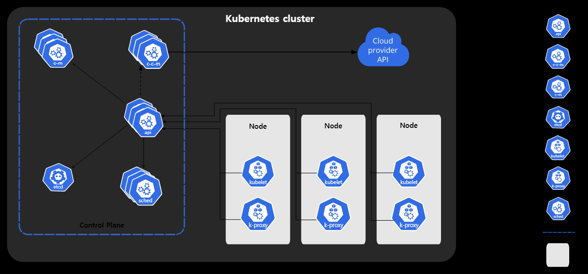

# Basic


## Database

### index

#### index 란?
이름 그대로, 책의 목차와 같이, '어떤 데이터가 어디에 있다' 라고 알려주는 것. 일종의 metadata

**왜 쓰는가?**  
만약 user_id 가 cjlee 인 사람을 찾고 싶다고 하면, 행이 100만 개가 있다고 할 때, 각 행을 뒤지면서 cjlee와 같은지 아닌지 확인해봐야 하는가? -> 상당히 비효율적임.

**어떻게 동작하는가?**  
https://velog.io/@emplam27/%EC%9E%90%EB%A3%8C%EA%B5%AC%EC%A1%B0-%EA%B7%B8%EB%A6%BC%EC%9C%BC%EB%A1%9C-%EC%95%8C%EC%95%84%EB%B3%B4%EB%8A%94-B-Tree

일단 기본적으로 B Tree, B+ Tree 를 통해 저장함. 
> 왜 hash table은 못쓰는가?
> 인덱스는 = 연산자 뿐만 아니라 >, < 등의 대소연산자도 사용하기 때문

0. 최대 M 개의 자식을 가질 수 있는 B 트리를 M차 B트리라고 함.  
1. B tree는 노드 하나당 여러 개의 데이터를 가질 수 있음.(최소 M - 1, 최대 (M/2) - 1)
2. 검색할 때에는, root node로부터 시작해서 보고 있는 key값보다 작냐/크냐에 따라 좌/우 자식 노드로 내려가면서 값을 찾음.
3. 삽입할 때에는, 조회와 마찬가지로 내려가서 위치를 찾은 다음, 해당 node의 capacity가 부족하면 가운데를 위쪽으로 올림.
4. 삭제할 때에는, 삭제하고 나서 있어야 하면 최소 개수보다 적다면 삭제한 노드의 부모노드와 형제노드를 merge

B+ tree의 경우, branch node는 영역을 가리키는 역할만 하고 실제 데이터(여기서는 row의 위치)는 leaf node에만 저장. 대신에, leaf node의 양 끝을 link 해서 다음 node로 빠르게 전환할 수 있도록 함.

**그래서**
인덱스를 걸어놓은 칼럼을 "정렬해서" 저장해놓음. 따라서 찾고자 하는 녀석보다 앞에 있는지, 뒤에 있는지를 따라서 쭉 타고 내려감. 발견하면, 해당하는 row의 메모리값을 참조해서 데이터를 가져옴(이 때 row는 여러개일 수 있다. index 걸은 칼럼이 unique key가 아닐 수 있기 때문에)

**언제 좋은가?**
1. where절을 많이 쓰는 칼럼에 인덱스를 걸면 좋다.
2. order by절을 많이 쓰는 경우에 인덱스를 걸면 좋다.
3. 결합 인덱스의 경우 cardinality가 높은 녀석을 걸어야 좋다.

> 주의. insert & delete 에는 좋지 않다.
### SQLZoo

#### select_from_nobel_tutorial
1. SELECT yr, subject, winner FROM nobel WHERE yr = 1950;
2. SELECT winner FROM nobel WHERE yr = 1962 AND subject = 'Literature';
3. SELECT yr, subject FROM nobel WHERE winner = 'Albert Einstein';
4. SELECT winner FROM nobel WHERE yr >= 2000 AND subject = 'Peace';
5. SELECT yr, subject, winner FROM nobel WHERE subject = 'Literature' AND yr BETWEEN 1980 AND 1989;
6. SELECT * FROM nobel WHERE winner IN ('Theodore Roosevelt', 'Woodrow Wilson','Barack Obama','Jimmy Carter');
7. SELECT winner FROM nobel WHERE winner LIKE 'John%';
8. SELECT yr, subject, winner FROM nobel WHERE (subject = 'Physics' AND yr = 1980) OR (subject = 'Chemistry' AND yr = 1984);
9. SELECT yr, subject, winner FROM nobel WHERE yr = 1980 AND (subject != 'Chemistry' AND subject != 'Medicine');
10. SELECT yr, subject, winner FROM nobel WHERE (subject = 'Medicine' AND yr < 1910) OR (subject = 'Literature' AND yr >= 2004);
11. SELECT * FROM nobel WHERE winner = 'PETER GRÜNBERG';
12. SELECT winner, yr, subject FROM nobel WHERE winner Like 'Sir%' ORDER BY yr DESC, winner ASC;
13. SELECT winner, yr, subject FROM nobel WHERE winner Like 'Sir%' ORDER BY yr DESC, winner ASC;
14. SELECT winner, subject FROM nobel WHERE yr=1984 ORDER BY subject IN ('Physics','Chemistry'), subject,winner;

#### SELECT within SELECT
1. SELECT name FROM world
  WHERE population >
     (SELECT population FROM world
      WHERE name='Russia');
2. SELECT name FROM world WHERE continent = 'Europe' AND gdp/population > (SELECT gdp/population FROM world WHERE name = 'United Kingdom');
3. SELECT name, continent FROM world WHERE continent IN (
SELECT continent FROM world WHERE name IN ('Argentina', 'Australia')
) ORDER BY name;
4. SELECT name, population FROM world WHERE
population > (SELECT population FROM world WHERE name = 'Canada') AND
population < (SELECT population FROM world WHERE name = 'Poland');
5. SELECT name, CONCAT(ROUND(population / (SELECT population FROM world WHERE name = 'Germany') * 100), '%')
FROM world 
WHERE continent = 'Europe';
6. SELECT name
FROM world
WHERE gdp > ALL(SELECT gdp FROM world WHERE continent = 'Europe' AND gdp > 0);
7. SELECT continent, name, area FROM world x
  WHERE area >= ALL
    (SELECT area FROM world y
        WHERE y.continent=x.continent
          AND area >0);
8. SELECT continent, name FROM world x WHERE x.name <= ALL (
  SELECT name FROM world y WHERE x.continent = y.continent
);
9. (*) SELECT name, continent, population
FROM world x
WHERE 25000000 >= ALL (
  SELECT population
  FROM world y
  WHERE x.continent = y.continent AND
  y.population > 0
);
10. (*)SELECT name, continent
FROM world x
WHERE population >= ALL (
  SELECT population * 3
  FROM world y
  WHERE x.continent = y.continent AND
  x.name != y.name
);


#### Sum AND Count
1. SELECT SUM(population)
FROM world;
2. SELECT continent
FROM world
GROUP BY continent;
3. SELECT sum(gdp)
FROM world
WHERE continent = 'Africa';
4. SELECT count(*)
FROM world
WHERE area > 1000000
5. SELECT SUM(population)
FROM world
WHERE name IN ('Estonia', 'Latvia', 'Lithuania');
6. SELECT continent, count(*)
FROM world
GROUP BY continent;
7. SELECT continent, count(*)
FROM world
WHERE world.population >= 10 * 1000000
GROUP BY continent;
8. SELECT continent
FROM world
GROUP BY continent
HAVING SUM(population) >= 100 * 1000000;

#### Join


# Working
## Kuberenetes

### kubectl 명령어
|명령어|설명|추가|
|:--:|:--:|:--:|
|apply|원하는 상태를 적용, -f 는 file|url도 가능|
|get|리소스 목록을 보여줌||
|describe|리소스의 상태를 자세히|pod의 이름 필요|
|delete|리소스 제거||
|logs|"컨테이너"의 로그를 확인|pod의 이름 필요|
|exec|"컨테이너에" 명령을 전달| -it 옵션(docker처럼) |
|config|kubectl 설정관리|`kubectl config current-context` = minikube|
|api-resources|전체오브젝트 종류 확인||
|explain|특정 오브젝트 설명 보기|e.g.`kubectl explain pod`|
|run|컨테이너로부터 pod 만들기|1.18 이상은 pod 생성, 미만은 deployment 생성|

### Pod

Kubernetes 클러스터 안에 Pod 들이 있고, Pod 안에 Container들이 있다.

### Component

### Control plain component
#### kube-apiserver
* 쿠버네티스 API를 노출하는 컴포넌트. 즉, 쿠버네티스 컨트롤 플레인의 프론트엔드. 수평적으로 확장 가능(=여러개의 kube-apiserver를 실행하고, 트래픽을 조절할 수 있다.)  
* 컨트롤 플레인의 핵심.  
* 최종 사용자, 클러스터의 다른 부분, 그리고 외부 컴포넌트가 서로 통신할 수 있도록 HTTP API를 제공.

#### etcd
클러스터의 데이터를 담는 key-value 저장소. 

#### kube-scheduler
노드가 배정되지 않은 새로 생성된 파드를 감지하고, 실행할 노드를 선택하는 컴포넌트.

#### kube-controller-manager
컨트롤러 프로세스를 실행하는 컴포넌트.
> Controller ? API 서버를 통해 클러스터의 공유된 상태를 감시하고, 현재 상태를 원하는 상태로 이행시키는 컨트롤 루프.  
> Node Controller = 노드가 다운되었을 때 통지와 대응에 관한 책임을 가짐  
> Replication Controller = 적절한 수의 Pod 개수를 유지하는 책임  
> Endpoint Controller = 서비스와 파드를 연결  
> Service account & token controller = 새로운 네임스페이스에 대한 기본 계정과 API 접근 토근을 생성.

### Node Component
동작중인 파드를 유지시키고, 쿠버네티스 런타임 환경을 제공하며, 모든 노드 상에서 동작.
#### kubelet
클러스터의 각 노드에서 실행되는 에이전트. "파드에서 컨테이너가 확실하게 동작하도록 관리한다"  
PodSpec(파드 스펙)의 집합을 받아서, 컨테이너가 해당 파드 스펙에 따라 건강하게 동작하도록 한다.

### Workload Resource Template(YAML)
* 필수 요소  
  |이름|설명|e.g.|ref|
  |:--:|:--:|:--:|:--:|
  |apiVersion|kubernetes API version|v1|https://kubernetes.io/ko/docs/reference/using-api/|
  |kind|생성할 리소스 타입(=오브젝트)|Pod||
  |metadata|name of namespce 또는 label|name: myAppPod
  |spec|상세 기술할 내용|아래 참조||

* spec  
  * containers : 파드 내부 컨테이너 (list로 여러 컨테이너 등록 가능)
    * image : docker hub에서 끌어올 이미지
    * name : 지정 이름
    * command / args : 실행할 명령어
    * livenessProbe : 헬스체크(실패시 재시작)
    * readinessProbe : 헬스체크(실패시 제외)
    * env : 환경변수 정의
  * replicas (Replicaset, Deployment 등 에서 사용?) : 레플리카 개수
  * selector (Service 리소스에서 사용?): label 기반으로 "서비스할 파드들 선택"
  * template : metadata랑 spec을 한번 더 정의.

> ReplicaSet과 Deployment는 kind 에서 밖에 차이가 없음.  
> 그렇다면 무슨 차이인가 ? -> 새로운 이미지로 업데이트 할 때.  


## Hadoop

### Chapter 2. hadoop & hive 설치.

```sh
$ java 8 이상 설치(sudo apt install default-jre)

# hadoop 설치
$ wget http://mirror.intergrid.com.au/apache/hadoop/common/hadoop-3.3.0/hadoop-3.3.0.tar.gz 
$ mkdir ~/hadoop
$ tar -xvzf hadoop-3.3.0.tar.gz
$ mv hadoop-3.3.0 ~/hadoop/

# hive 설치
$ wget https://downloads.apache.org/hive/hive-3.1.2/apache-hive-3.1.2-bin.tar.gz
$ mkdir ~/hive
$ tar -xvzf hive-3.1.2-bin
$ mv hive-3.1.2-bin ~/hive/

# 환경 변수 세팅

$ vi ~/.zshrc
---
# [APPEND THESE LINES]
export JAVA_HOME=/usr/lib/jvm/java-11-openjdk-amd64
export HADOOP_HOME=/home/cjlee/hadoop/hadoop-3.3.0
export PATH=$PATH:$HADOOP_HOME/bin
export HADOOP_CONF_DIR=$HADOOP_HOME/etc/hadoop
---
$ source ~/.zshrc

# Hadoop 세팅
$ cd ~/hadoop/hadoop-3.3.0/etc/hadoop

## hadoop-env.sh - 하둡 환경설정 파일
$ vim hadoo-env.sh
# JAVA_HOME, HADOOP_HOME 찾아서 주석 해제 후 .zshrc와 똑같이 적용
export JAVA_HOME=/usr/lib/jvm/java-11-openjdk-amd64
export HADOOP_HOME=/home/cjlee/hadoop/hadoop-3.3.0
export HADOOP_CONF_DIR=${HADOOP_HOME}/etc/hadoop

## core-site.xml - 코어 설정
<configuration> 태그 사이에 다음 추가

<property>
    <name>fs.defaultFS</name>
    <value>hdfs://localhost:9000</value>
</property>
## hdfs-site.xml - hdfs 설정(분산파일시스템)
<configuration> 태그 사이에 다음 추가

<property>
    <name>dfs.replication</name>
    <value>1</value> 
</property>

-> 복제본을 하나만 두겠다(원래 분산파일시스템은 3개를 저장하는게 default)
## yarn-site.xml - 얀 설정(대충 맵리듀스쪽 설정)
은 나중에

## mapred-site.xml - 맵리듀스 설정(위쪽은 hdfs)
<configuration> 태그 사이에 다음 추가

<property>
    <name>mapreduce.framework.name</name>
    <value>yarn</value>
</property>
<property>
    <name>mapreduce.application.classpath</name>
    <value>$HADOOP_MAPRED_HOME/share/hadoop/mapreduce/*:$HADDOP_MAPRED_HOME/share/hadoop/mapreduce/lib/*</value>
</property>

# ssh localhost 설정
$ ssh localhost

# 나중에 sbin/start-all.sh 실패시 ssh 재설정
$ cd ~
$ ssh-keygen -t rsa -P '' -f ~/.ssh/id_rsa
$ cat ~/.ssh/id_rsa.pub >> ~/.ssh/authorized_keys
$ chmod 0600 ~/.ssh/authorized_keys
```

**실행**
```sh
# 처음에 네임노드를 한 번 포맷해야 함.
$ cd ~/hadoop/hadoop-3.3.0/bin
$ hdfs namenode -format

# hdfs 실행
$ cd ~/hadoop/hadoop-3.3.0/sbin
$ ./start-all.sh

# mapreduce 실행
$ ./start-yarn.sh
```

#### HDFS 확인
localhost:9870

하둡분산파일시스템의 상태를 볼 수 있음.  
e.g. LiveNodes 살아있는 노드의 개수(아까 replication을 1로 설정했기 때문에 1로 나옴)

#### Mapreduce 확인
localhost:8088  

실행되는 어플리케이션을 확인할 수 있음.

### Chapter 3. HDFS 이해
분산 플랫폼 : 물리적으로 여러 대의 서버가 하나의 클러스처럼 동작하는 플랫폼

* Master-slave 구조 = master가 결정, slave가 따름. (slave는 확장적) (=HDFS가 이 구조를 따름.)
* Non-master-slave 구조 = master가 해야하는 일, 정보 등을 모든 노드들이 공유.

> Master-slave 구조에서는 Master에 부하가 가지 않는 것이 중요하다. 따라서 client는 데이터를 주고받거나 할 때 slave와 통신한다.(not master)

#### 구글 플랫폼 철학
1. 한대의 고가 장비보다 여러 대의 저가 장비가 낫다.(scale-up < scale-out)
2. 데이터는 분산 저장한다. (병렬과 분산은 비슷하지만 조금 다름. 병렬은 CPU에 가까운 관점, 분산은 Data에 가까운 관점.)
3. 시스템(H/W)는 언제든 죽을 수 있다.(Smart S/W로는 부족하다.)
4. 시스템 확장이 쉬워야 한다.  
... etc   

===> 분산 & 자동화 를 목적으로 함.

#### 하둡 특성
1. 수천 대 이상의 리눅스 기반 범용 서버들을 하나의 클러스터로 사용(온프레미스, 클라우드 상관X)
2. Master-slave 구조
3. 파일은 block 단위로 저장
4. 블록 데이터의 복제본 유지로 인한 신뢰성 보장(replication, default 3개)
5. 높은 내고장성(Fault-tolerance)
6. 데이터 처리의 지역성 보장.

#### Block
하나의 파일을 여러개의 Block으로 나누어서 저장. default는 64MB 또는 128MB  
e.g. A 파일은 100MB ? -> 64 & 36 으로 나누어서 여러 노드에 저장.  
블록이 커야 탐색 비용을 최소화 할 수 있다. && 하드디스크에서 블록의 시작점을 탐색하는 시간(seek time)을 줄일 수 있다. && 네트워크를 통해 데이터를 전송하는데 많은 시간을 할당 가능.

#### 1분에 24GB가 생기는 데이터가 있다고 해보자.
즉, time-series data가 있다고 할 때. 하둡은 데이터를 어떻게 저장하는가? (스타트는 어떻게든 끊을 수 있다. e.g. 하둡 런 or 카프카)  
1. 24GB를 128MB(블록) 단위로 쪼갠다.
2. 쪼갠 데이터의 적절한 위치(같은 내용인 복제 블록은 같은 노드에 저장되지 않음)에 저장한다.
3. slave가 master에게 3초마다 heart-beat(헬스체크)를 보낸다.
4. 만약 heart-beat가 일정 시간 오지 않으면, 해당 데이터노드를 장애로 생각
5. 네임노드는 어떤 데이터의 어떤 블록이 어디 노드에 저장되어있는지 알고 있다.
6. 따라서, 장애

# Error Handling

# 1. Kubernetes - kubectl 사용

* 시도 : kubectl get all 혹은 kubectl apply -f SOME_FILE.yml
* 원인 : minikube(kubernetes)가 구동중이 아님
* 해결(*) : minikube start (필요시 --driver=(docker))
