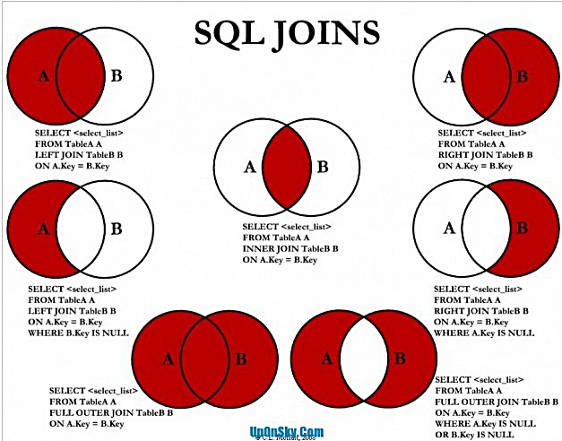

# 기초
## DataBase
https://suhwan.dev/2019/06/09/transaction-isolation-level-and-lock/  격리레벨과 락

### redo, undo log
* 둘 다 "복구"의 역할을 한다.
* 차이점은, 이름처럼 redo는 "다시 실행해서 복구" 하기 위한 log이고, undo는 "원 상태로 되돌려서 복구".
* 즉, redo = "commit을 다시 하려는 시도", undo = "rollback을 다시 하려는 시도"

#### redo
모든 변경사항은 redo log에 기록됨.(undo 포함)

### Join의 종류


TABLE.Key is NULL 을 통해 교집합 부분을 선택하거나 선택하지 않을 수 있다.

++

* Equi Join : Equality Condition(=)에 의한 조인  
```sql
-- 1)
SELECT [columns] FROM dept d, emp e WHERE d.deptno = e.deptno;
-- 2) INNER JOIN
SELECT [columns] FROM dept d INNER JOIN emp e ON d.deptno = e.deptno;
-- 3) NATURAL JOIN 1, 동일한 컬럼을 모두 기준으로 join
SELECT [columns] FROM dept d NATURAL JOIN emp e;
-- 4) NATURAL JOIN 2, 선택한 칼럼만 기준으로 join
SELECT [columns] FROM dept d NATURAL JOIN emp e USING (deptno);
```

### SQLZOO
1. SELECT name FROM teacher WHERE dept IS NULL;
2. SELECT teacher.name, dept.name FROM teacher INNER JOIN dept ON (teacher.dept=dept.id);
3. SELECT teacher.name, dept.name FROM teacher LEFT OUTER JOIN dept ON teacher.dept = dept.id;
4. SELECT teacher.name, dept.name FROM teacher RIGHT OUTER JOIN dept ON teacher.dept = dept.id;
5. SELECT name, COALESCE(mobile, '07986 444 2266') FROM teacher;
6. SELECT teacher.name, COALESCE(dept.name, 'None') FROM teacher LEFT OUTER JOIN dept on teacher.dept = dept.id;
7. SELECT COUNT(name), COUNT(mobile) FROM teacher;
8. SELECT dept.name, COUNT(teacher.name) FROM teacher RIGHT OUTER JOIN dept ON teacher.dept = dept.id GROUP BY dept.name;
9. SELECT name, CASE WHEN dept IN (1, 2) THEN 'Sci' ELSE 'Art' END FROM teacher;
10. SELECT name, CASE WHEN dept IN (1,2) THEN 'Sci' WHEN dept = 3 THEN 'Art' ELSE 'None' END FROM teacher;


