# UTM ?
2021.07.25 기준, 아직까지는 M1 Mac에서는 VirtualBox나 Vmware 같은 가상머신 소프트웨어가 지원되지 않는 것으로 확인됩니다.
* [Is Apple Silicon ready?](https://isapplesiliconready.com/kr)

Parallels 같은 유료 소프트웨어도 있지만, 비싼 가격에 섣불리 구매하기가 망설여지는데, 찾아보니 UTM 이라는 소프트웨어로 대체할 수 있다는 소식을 발견했습니다. 

* [Virtual Box vs. UTM: Run Virtual Machines on Your Apple Silicon M1 Mac](https://eshop.macsales.com/blog/72081-utm-virtual-machine-on-m1-mac/)
* [UTM - 나무위키](https://namu.wiki/w/UTM)

> MacOS Version : Big Sur 11.4  

## 설치 방법
설치 방법은 간단합니다.  우선, 아래 링크로 접속해서 다운로드 해주세요. 
(앱스토어에서 구매는 일종의 Donation 개념입니다. 자동 업데이트 정도의 차이가 있다고 하네요.)
[UTM | Virtual machines for Mac](https://mac.getutm.app)

다운로드 이후에, 실행하면 다음과 같은 화면을 볼 수 있는데요. 

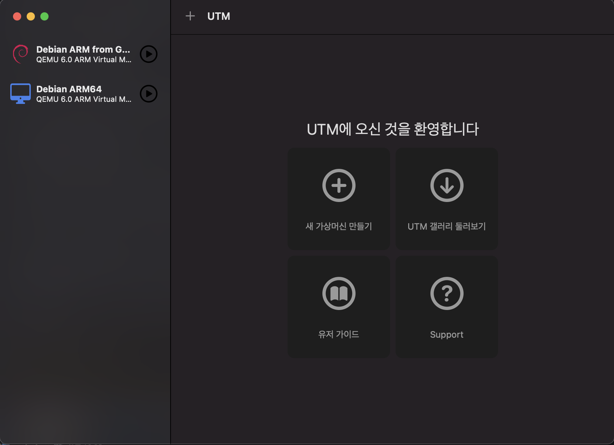

새 가상머신 만들기를 클릭해서, VirtualBox 에서 사용하던 것 처럼 직접 iso 파일을 넣어줄 수도 있지만, 
갤러리라는 곳을 활용하면 좀 더 간편하게 사용할 수 있습니다.

https://mac.getutm.app/gallery/

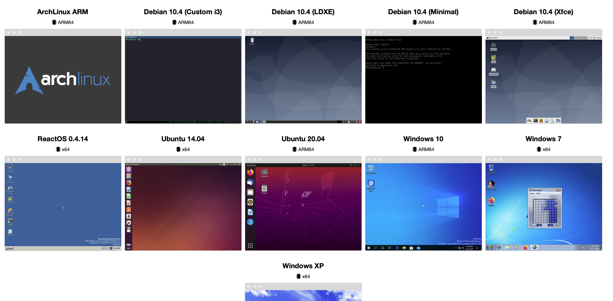

아치 리눅스나 데비안, 우분투, 또는 윈도우도 보이네요.
저는 여기서 Debian 10.4, Minimal을 선택하겠습니다.
윈도우의 경우, 다음을 참고해주세요
* [Windows 10 | UTM](https://mac.getutm.app/gallery/windows-10-arm) -> 하단의 Instructions
* [페러렐즈 안쓰고 무료로 M1 맥에 윈도우 설치하기 – Toyrit](https://toyrit.com/install-windows-on-m1-with-utm/)
* [UTM으로 M1 맥에 설치된 윈도우에 인터넷 드라이버 설치 – Toyrit](https://toyrit.com/how-to-install-utm-m1-windows-internet-driver/)
* [YouTube](https://www.youtube.com/watch?v=yWRzZYrSXDA)

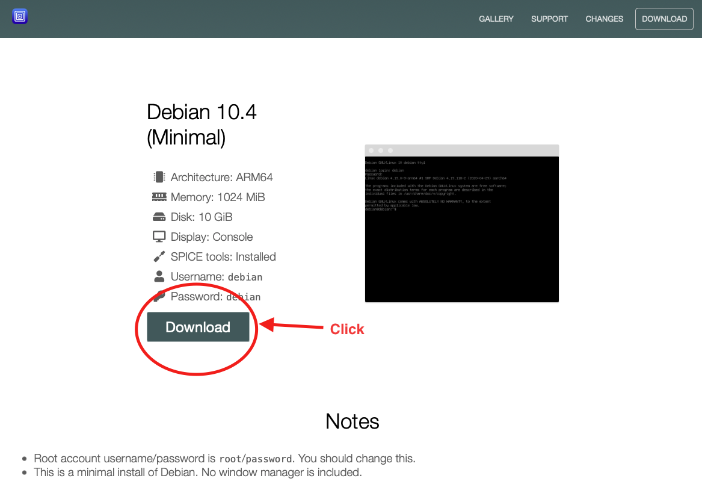

다운로드 버튼을 클릭하면, `Debian ARM.utm` 이라는 파일을 다운받게 됩니다.
그리고, 이 파일을 실행하기만 하면 됩니다. 간단하네요.

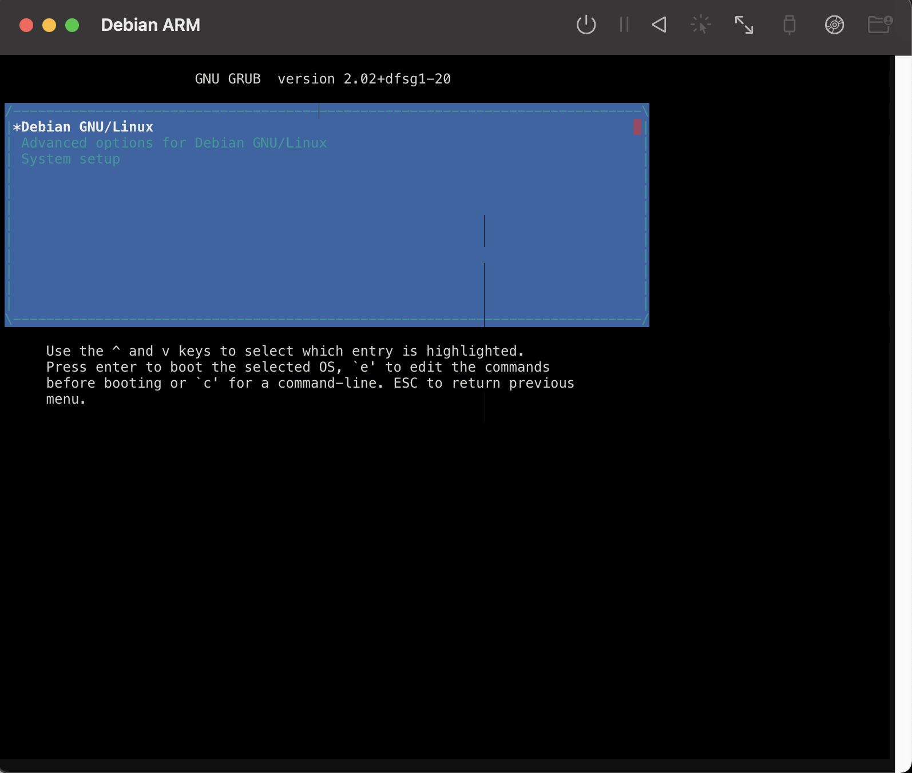
여기서 Debian GNU/Linux 를 선택하면 됩니다.

초기 비밀번호는 다음과 같이 세팅되어 있습니다.
* root의 경우 root / password
* user(debian)의 경우 debian / debian

## Options
실행중인 가상머신을 종료한 후, 
좌측의 가상 머신 list 중 새로 생긴 Debian ARM 을 우클릭하면, Edit 버튼을 확인할 수 있습니다.
여기서 여러 옵션을 선택할 수 있는데, 제가 수정한 옵션만 나열해보겠습니다.

### 1. Memory
[System] 탭으로 가면, 메모리가 초기에는 1024mb로 설정되어 있을 텐데, 
저는 그냥 편하게 사용하고자 8192mb를 할당해주었습니다.

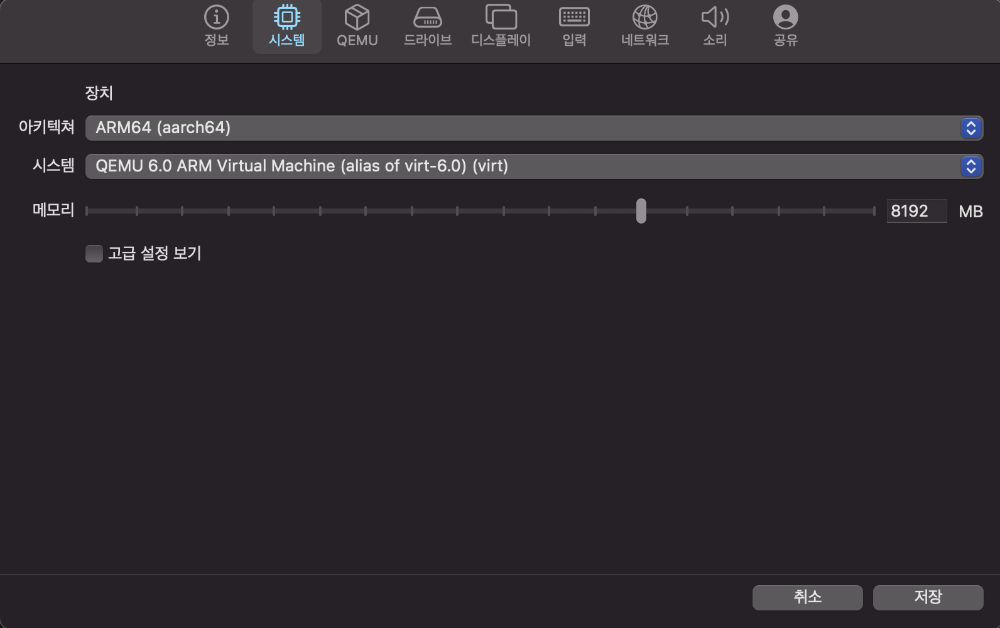

### 2. Display
[Display] 탭에는, 그래픽 인터페이스와 콘솔 인터페이스를 선택할 수 있습니다.
설치한 OS에 GUI가 같이 들어있는 경우 당연히 그래픽 인터페이스를 선택하겠지만, 
저는 Minimal을 선택했기 때문에 GUI 가 필요 없다고 생각해서 콘솔 인터페이스를 선택했는데, 
곧 그래픽 인터페이스가 낫다는 것을 깨달았습니다.

lsblk 명령어는 filesystem으로부터 명시된 block devices (간단하게, 보조기억장치(하드디스크))에 대한 정보를 출력합니다.
그런데, 콘솔 인터페이스에서는 모양이 예쁘게 나오지 않더라구요.

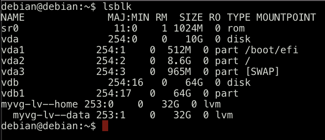

기대했던 모습은 아래와 같았습니다.

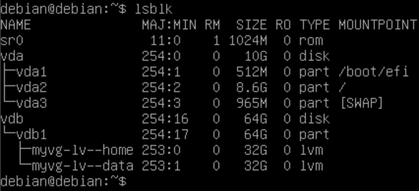

뿐만 아니라, manpage도 조금씩 깨져서 나오는 경향이 있었습니다.

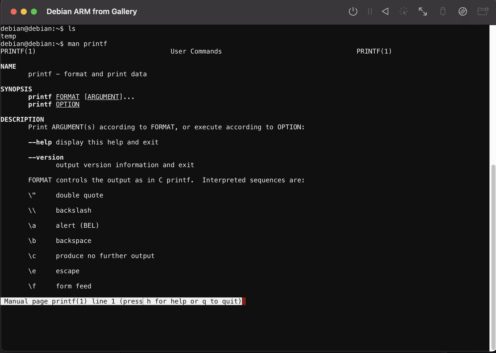

우측 상단의 화살표 두개가 있는 버튼이 Send Console Resize Command 로,
드래그한 화면에 콘솔 크기를 맞춰주는 명령어가 입력되는데, 이를 활용해도 일부 크기가 맞지 않는 현상은 여전했습니다.

설정된 옵션은 다음과 같습니다.

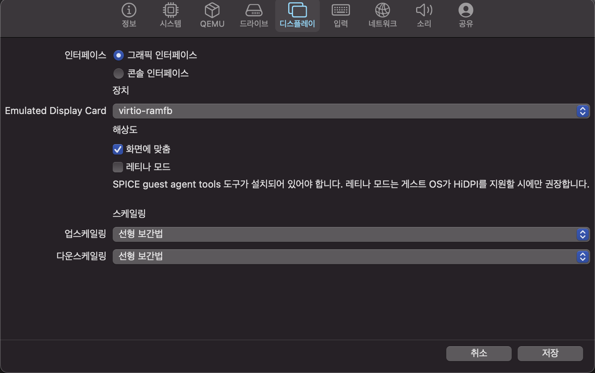

## 3. Disk
초기에 아무것도 건드리지 않으면, 디스크 공간이 약 10G 정도 할당이 되어있습니다.

[Drive] 탭으로 이동해서 확인해보면 아마 아래와 같은 모습일텐데요.
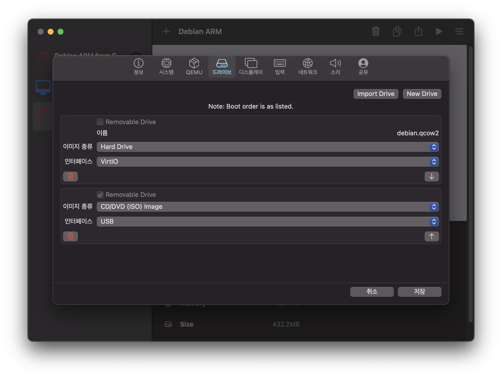
저는 조금 더 사용하고 싶어서, 추가적으로 디스크를 붙였습니다.
우측 상단의 New Drive를 클릭하고, VirtIO, 그리고 사용할 용량인 64gb 를 입력했습니다.
그리고 순서를 바꿔서, 기존에 있던 두 개의 드라이브 사이, 즉 두 번째에 위치시켰습니다.
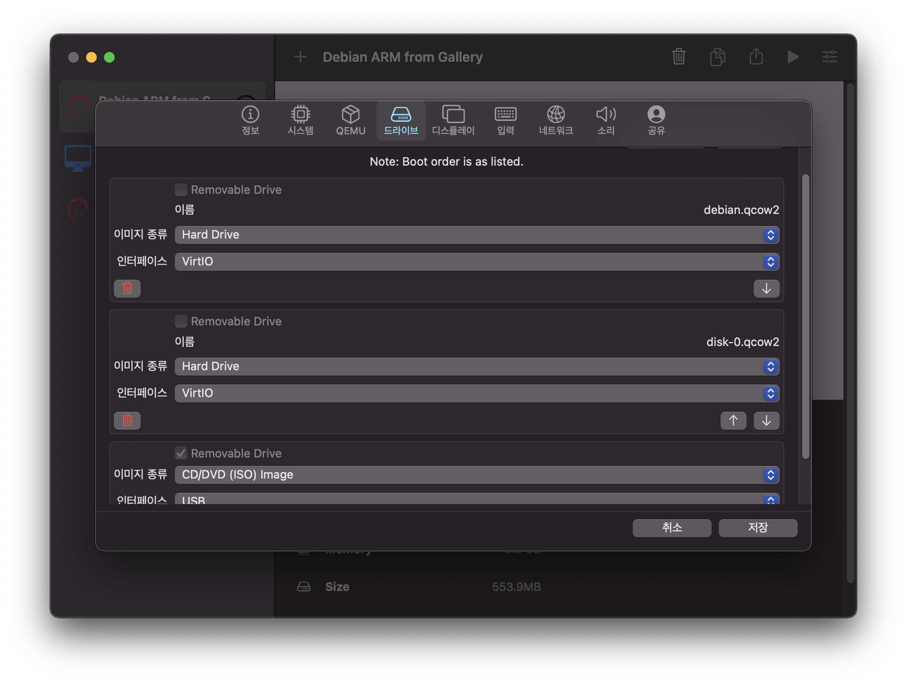
참고로, VirtIO 로 디스크를 등록할 경우, 해당 drive는 /dev/vdX (X는 a부터 순서대로 붙인 특정 알파벳입니다.) 로 연결됩니다.
만약 sda 로 사용하고 싶다면(즉, /dev/sdX), VirtIO가 아닌 SCIC 를 선택해주면 됩니다.

> Note.  sda 와 vda 의 차이는 다음을 참고하세요.  
> sda -> Full virtualization  
> vda -> Paravirtualization  
> https://developer.ibm.com/articles/l-virtio/  

## 결론
여러 기능들이 잘 동작하는지는 좀 더 사용해봐야 알겠지만, 
당장 가상머신을 돌릴 수 있다는 것만으로도 충분히 만족스럽습니다.

M1 Mac에 대한 정보가 많이 없는데, 도움이 되었으면 좋겠습니다.
감사합니다.
