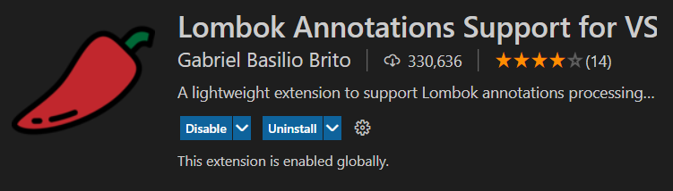

# SpringBoot Project

## 1. install

1. vscode 설치  
https://code.visualstudio.com/
2. Extension Pack for java 확장팩 설치

3. Spring Boot Extension Pack 확장팩 설치

4. (Optional) Lombok Annotations Support for VS Code

## 2. create a new project

방법 1) https://start.springio
방법 2) Ctrl+Shift+P -> Spring Initializer : create a gradle project 