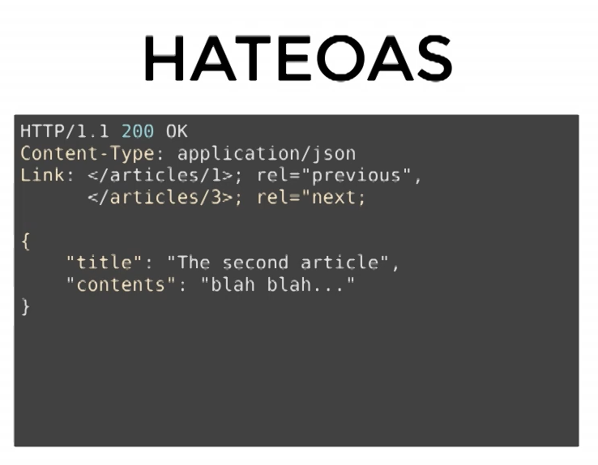

# REST
REpresentational State Transfer = a way of providing interoperability(상호운용성) between computer systems on the Internet (위키피디아)

Q : 어떻게 인터넷에서 정보를 "잘" 공유할 수 있을까?
A : 정보들을 하이퍼텍스트로 연결한다. (표현형식 : HTML, 식별자 : URI, 전송방법 HTTP)

기존 HTTP는 널리 사용되고 있었는데, 표준이 명확히 성립되지 않은 상태였음.  
Roy Fielding : 어떻게 웹을 무너트리지 않고 HTTP를 개선할 수 있을까?  
-> HTTP Object Model 이란 것을 만듬 = 4년후에 REST라는 이름으로 발표 && 박사 논문

# API
Microsoft 에서 SOAP를 개발 -> 원격으로 메소드 호출 가능 But 복잡  
사람들은 SOAP를 복잡하고, 규칙이 많고, 어렵다고 느낌  
==> REST 는 반대. REST의 인기 상승.

그런데 사람들이 사용하는 REST와, 로이 필딩이 말하는 REST는 다름.

REST = 분산 하이퍼미디어 시스템(e.g. 웹)을 위한 아키텍처 스타일.  
* 아키텍처 스타일 ? 제약조건의 집합. 이를 **모두** 지켜야 REST를 지키는 것.

REST는 아키텍처 스타일(제약조건의 집합)의 집합이다.

6가지 스타일로 이루어져 있음.
1. client-server
2. stateless
3. cache
4. uniform interface
5. layered system
6. code-on-demand(optional) (서버에서 코드를 클라이언트로 보내서, 실행하는것 = 자바스크립트)

대체로 좋은데, uniform interface를 잘 못지킴
## uniform interface의 제약조건
1. identification of resources (resource가 uri로 식별될 수 있어야 한다.)
2. manipulation of resources through representations(representation 전송을 통해서 resource를 조작해야 한다.)

이 두개는 대체로 잘 지킴

3. self-decriptive messages
4. hypermedia as the engine of application state(HATEOAS)

이 두개는 거의 제대로 못지킴

## self-descriptive message
: 메시지는 스스로를 설명할 수 있어야 한다.

BAD

GOOD

BAD

BAD

GOOD

## HATEOAS
: 애플리케이션의 상태는 Hyperlink를 이용해 전이되어야한다.

이러한 상태의 전이는 link를 따라 움직인다.

# 다 좋은데..
왜 이렇게 해야할까?  
**서버와 클라이언트의 독립적인 진화를 위해**  
즉, 서버의 기능이 변경되어도 클라이언트를 업데이트할 필요가 없다.

REST가 지켜지고 있는 사례 : WEB  
why ? 
웹페이지가 변경되었다고 해서, 웹브라우저를 업데이트할 필요가 없다.  
웹브라우저를 업데이트했다고 해서, 웹페이지를 변경할 필요도 없다.  
HTTP 명세가 변경되어도, HTML 명세가 변경되어도 웹은 잘 동작한다.  
(물론, 깨지는 현상은 발생...)

# 그렇다면 REST가 웹의 독립적 진화에 도움을 주었는가?
1. HTTP에 지속적으료 영향을 줌
2. Host 헤더 추가
3. 길이제한을 다루는 방법이 명시됨(414 URI Too long ...)
4. URI에서 리소스의 정의가 추상적으로 변경됨 : "식별하고자 하는 무언가"
5. 기타 HTTP와 URI에 많은 영향을 줌
6. HTTP/1.1 명세 최신판에서 REST 에 대한 언급이 들어감.

# Self-descriptive와 HATEOAS가 어떻게 독립적 진화에 도움을 주었을까?
* self-descriptive : 서버나 클라이언트가 변경되더라도 오고가는 메세지는 언제나 self-descriptive 하므로 언제나 해석 가능하다.
* HATEOAS : 어디서 어디로 전이가 가능한지 미리결정되지 않는다. (late binding). 쉽게 말해서, 링크는 동적으로 변경될 수 있다. 링크가 변경되더라도 사용자는 따라가기만 하면 됨.

# REST는 성공했다.
그러나, REST API는 대부분 REST 아키텍처를 따르지 않는다.  

그럼 꼭 이렇게 REST 아키텍처 스타일을 지켜야 하는가?  
YES. 제약 조건을 모두 지켜야 REST 라고 이야기할 수 있다.

# 그럼 꼭 API를 REST API로 만들어야 하는가?
로이 필딩 : "REST는 통제 불가능한 시스템을 유지하기 위한 진화를 강조한다. 시스템 전체를 통제할 수 있다고 생각하거나, 진화에 관심이 없다면, REST에 대해 따지느라 시간을 낭비하지 마라."

# 왜 REST API 구현이 어려운가 ?

json은 문법은 해석할 수 있지만, 그 의미를 파악하기가 어렵다.  
(html은 태그에 대한 명세가 있지만, json은 내맘대로 만들수도 있다...)

이렇게 있다고 해보자.
## HTML은
* Self-descriptive : IANA에서 text/html에 대한 설명을 찾고, 이는 w3.org에 문서가 있다는 명세가 있음. 거기 가서 해석하면 됨.
* HATEOAS : HTML은? 링크를 통해 전이가 가능. 

## JSON은
* self-descriptive : IANA에서 json의 설명을 찾고, 거기 가서 파싱을 해석함. 근데 id가 뭔지, title이 뭔지 알 수 있는 방법이 없음.
* HATEOAS : 링크 자체가 없음. 

# 그러면 json을 RESTful 하게 바꿔보자.

1. Self-descriptive를 해결하려면
**Media type을 새로 재정의한다**  
  1] 즉, 미디어 타입(내가 정의하는)을 하나 정의한다.  
  2] 미디어 타입 문서를 작성한다(id가 뭔지, title이 뭔지...)  
  3] IANA에 미디어타입을 등록한다. (작성한 문서를 미디어 타입의 명세로 등록한다)  
  4] 이제 이 메시지를 보는 사람은 명세를 찾아갈 수 있으므로 메시지의 의미를 온전히 해석할 수 있다(id가 뭔지, title이 뭔지)  

But... media type을 매번 다시 정의해야하는 번거로움이 있다.  
-> 다른 방법은?
이러한 명세가 뭔지에 대한 명세를 정의한 링크(profile)를 걸어놓는다.  

즉, id가 뭔지, title이 뭔지에 대한 명세를 작성하고, link 헤더에 이를 링크.  
여기에 대해서도 단점은, 클라이언트가 Link헤더와 profile을 이해해야 한다.  
*[?] content negotiation이 불가능하다.

2. HATEOAS 를 해결하려면

  1] 그냥 "link" : "https://example.org/todos/1" 과 내용을 데이터에 박아버린다.(but, 링크를 표현하는 방법을 직접 정의해야함. 즉, self-descriptive를 다시 해결해야함)

또는

  2] 기존에 하이퍼링크를 표현하는 방법을 정의한 명세를 활용한다. (JSON API, HAL, UBER ...)

또는

  3] HTTP 헤더로 표현한다.

# 궁금점
## 하이퍼링크는 반드시 URI여야 하는가?
**그렇지는 않다.**

어쨌든 하이퍼링크라는것만 표현되면 된다.

## Media type을 꼭 등록해야 하는가(e.g. IANA)
: 그럴 필요는 없다. 회사 내부 사람들이 모두 알고 있다면. **하면 좋고**

# 정리

